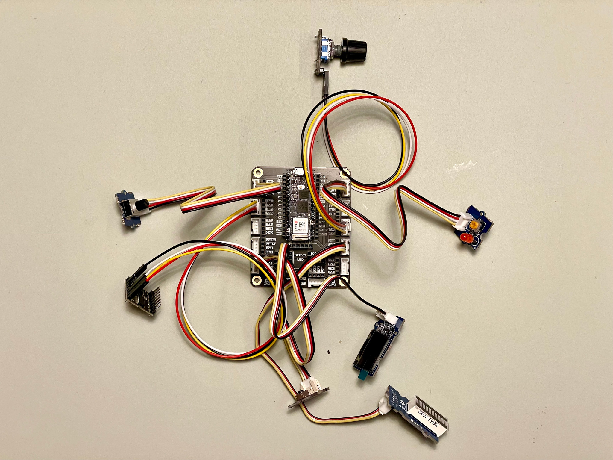

# MicroPython with Arduino Boards

This repository contains the examples as presented in the Arduino/Elektor webinar. You can access the recording [here](https://www.youtube.com/watch?v=kP57-IJMQJs) 📹. Here you will also find some bonus examples that were not shown in the webinar.

- In the webinar we discussed the capabilities of MicroPython on Arduino boards.
- We had a look at example scripts to learn how to access pins, interact with sensors and more.  
- We had a look at some machine vision examples that were implemented in MicroPython using the amazing OpenMV infrastructure.

The goal of this repository is to help you prepare your Arduino hardware for MicroPython and provide useful examples so that you can try them out yourself with your own hardware. In the webinar the different building blocks to put together a custom **music player** were presented. You can follow the examples to have everything in your toolbelt to replicate the project.



## On Micropython

MicroPython is a compact and efficient implementation of the Python programming language that is optimized for microcontrollers and embedded systems. It provides a familiar and easy-to-learn language syntax and allows developers to quickly prototype and develop applications for microcontrollers. One of the main advantages is the built-in REPL.

The MicroPython REPL (Read-Evaluate-Print-Loop) is a powerful tool that can significantly speed up the development process by allowing developers to test pieces of code interactively and interact with hardware components dynamically without the need to recompile and upload firmware. The REPL allows developers to quickly test code snippets and evaluate their output in real-time, making it easier to debug and refine code on the fly. The REPL provides an interactive shell that can be used to interact with hardware components and execute commands in real-time, which can be especially useful when working with sensors, actuators, and other peripherals. By providing this level of interactivity and flexibility, the MicroPython REPL can greatly accelerate the development process and make it easier for developers to iterate quickly and efficiently.

## Requirements

- [Arduino Lab For MicroPython](https://labs.arduino.cc/en/labs/micropython)
- A compatible Arduino board. See [here](https://docs.arduino.cc/micropython/).
- [OpenMV](https://openmv.io/pages/download) (for machine vision examples).

## Setup

You first need to install MicroPython on your board. The instructions for that can be found [here](https://docs.arduino.cc/micropython/basics/board-installation). During that process you will upload the MicroPypthon firmware to your board.
Once you're done with that you can use the board with "Arduino Lab For MicroPython".
After connecting to the board you can do a first interaction with your board which is turning on the built-in LED. Type the following commands line by line and you should see the LED light up:

```python
from machine import Pin
led = Pin("LED_BUILTIN", Pin.OUT)
led.on()
```

TODO: Setup libraries
TODO: Pins csv

## Examples

- `BME680.py` 
- `OpenMV` 
- `TM1637.py` 
- `adc.py` 
- `blink.py` 
- `button.py` 
- `button_advanced.py` 
- `button_interrupt.py` 
- `dfplayer.py` 
- `http.py` 
- `json.py` 
- `lsm6dsox.py` 
- `my9221.py` 
- `neopixel.py` 
- `pot_led_bar.py` 
- `pwm.py` 
- `rotary_encoder.py` 
- `servo.py` 
- `ssd1315.py` 
- `timer.py` 
- `uasyncio.py` 

## Mini Project
player_combo.py